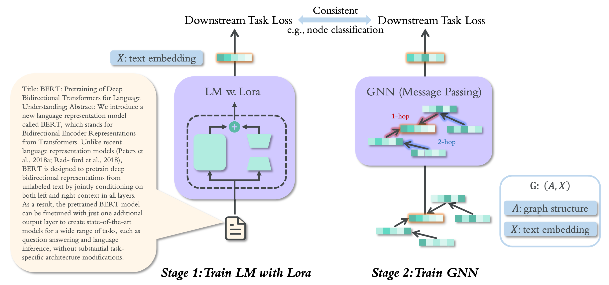

# SimTG: A Frustratingly Simple Approach For Textual Graph Representation Learning
<!--  -->
<p align='center'>

</p> 

 

This is the official repository of SimTeG. resoureces: [[Paper]](https://arxiv.org/abs/2308.02565) [[Generated Embeddings]](https://huggingface.co/datasets/vermouthdky/SimTeG)

```bibtex
@misc{duan2023simteg,
      title={SimTeG: A Frustratingly Simple Approach Improves Textual Graph Learning}, 
      author={Keyu Duan and Qian Liu and Tat-Seng Chua and Shuicheng Yan and Wei Tsang Ooi and Qizhe Xie and Junxian He},
      year={2023},
      eprint={2308.02565},
      archivePrefix={arXiv},
      primaryClass={cs.CL}
}
```

## Environment
```bash
conda install pytorch torchvision torchaudio pytorch-cuda=11.8 -c pytorch -c nvidia
conda install pyg -c pyg
conda install -c dglteam/label/cu118 dgl # for RevGAT
pip install transformer
pip install optuna # for hp search
pip install deepspeed # recommend using deepspeed if you want to finetune LM by your self
```

## Reproduce Results of SimTG
We achieve new SOTA on OGBN-Arxiv.
| GNN | Valid Acc. (%) | Test Acc. (%) |
|----|----|----|
| GraphSAGE | 77.89 ± 0.08 | 77.48 ± 0.11 |
| RevGAT | 78.46 ± 0.04 | 78.03 ± 0.07 |
### 1. Get Started With An Example

For all results reported in our paper on OGBN-Arxiv, OGBN-Products, and OGBL-citation2-2.7M, we place the training scripts at `./scripts`. Here is an example of reproducing the results of `e5-large` (LM) + `GraphSAGE` (GNN).

##### 1. We should first finetune the language model on specific dataset:

```bash
dataset=ogbn-arxiv
model_type=e5-large
suffix=main

# it takes half an hour with 4 A100 (40G)
bash scripts/train.sh --model_type e5-large --dataset ogbn-arxiv --suffix main \
    --data_folder ./data \
    --pretrained_repo sentence-transformers/e5-large \
    --lr 5e-5 \
    --weight_decay 1e-5 \
    --batch_size 20 \
    --eval_batch_size 200 \
    --accum_interval 5 \
    --label_smoothing 0.3 \
    --epochs 10 \
    --warmup_ratio 0.15 \
    --lr_scheduler_type linear \
    --use_peft \
    --peft_r 4 \
    --peft_lora_alpha 8 \
    --peft_lora_dropout 0.3 \
    --header_dropout_prob 0.6 \
    --deepspeed ds_config.json # optional, we use stage 2 of deepspeed
```

all output will be saved at `./out/${dataset}/${model_type}/${suffix}`
specifically, the generated embs are at `./out/${dataset}/${model_type}/${suffix}/cached_embs/x_embs.pt`. Here it is `./out/ogbn-arxiv/e5-large/main/cached_embs/x_embs.pt`.

##### or download the `x_embs.pt` from our huggingface repo.

```bash
from huggingface_hub import snapshot_download

repo_id = "vermouthdky/X_lminit"
snapshot_download(
    repo_id=repo_id,
    repo_type="dataset",
    local_dir="./out",
    local_dir_use_symlinks=False,
    allow_patterns=["ogbn-arxiv/e5-large/main/cached_embs/x_embs.pt"], # for your own use
)
```
##### 2. Then we train a GraphSAGE on top of the generated embeddings:
```bash
lm_model_type=e5-large
suffix=main_X_${lm_model_type}
bert_x_dir=out/ogbn-arxiv/e5-large/main/cached_embs/x_embs.pt # should be consistent
bash scripts/single_gpu_train.sh --model_type $model_type --dataset $dataset --suffix $suffix \
    --n_exps 10 \
    --single_gpu 0 \
    --lm_type $lm_model_type \
    --gnn_batch_size 10000 \
    --gnn_eval_batch_size 10000 \
    --gnn_epochs 100 \
    --gnn_dropout 0.4 \
    --gnn_label_smoothing 0.4 \
    --gnn_lr 0.01 \
    --gnn_num_layers 2 \
    --gnn_weight_decay 4e-6 \
    --gnn_eval_interval 1 \
    --use_bert_x \
    --bert_x_dir $bert_x_dir
```

### 2. Do Ensembling

Following the above instruction, we can train GNNs on multiple embeddings. To reproduce the results on OGBN-Arxiv, one should train A GNN on original text and [TAPE](https://github.com/XiaoxinHe/TAPE) with various LMs (e5-large and all-roberta-large-v1).

```bash
bash scripts/ogbn-arxiv/e5-large/main.sh
bash scripts/ogbn-arxiv-tape/e5-large/main.sh
bash scripts/ogbn-arxiv/roberta-large/main.sh
bash scripts/ogbn-arxiv-tape/roberta-large/main.sh

bash scripts/ogbn-arxiv-tape/revgat/main.sh # contains all training scripts

logits1=out/ogbn-arxiv/revgat/ensemble_X_e5-large/cached_embs
logits2=out/ogbn-arxiv/revgat/ensemble_X_all-roberta-large-v1/cached_embs
logits3=out/ogbn-arxiv-tape/revgat/ensemble_X_e5-large/cached_embs
logits4=out/ogbn-arxiv-tape/revgat/ensemble_X_all-roberta-large-v1/cached_embs
logits5=out/ogbn-arxiv/revgat/ensemble_preds/cached_embs

python compute_ensemble.py \
    --list_logits "${logits1} ${logits2} ${logits3} ${logits4} ${logits5}" \
    --weights 2 2 1 1 1 \
    --start_seed 1
```

## Misc: HP Search with Optuna
We search our hyperparameter with optuna. We Implement an easy-to-use search framework for both LMs (distributed) and GNNs (single GPU). One can check out its usage at `./scripts/hp_search` and code at `./src/run_optuna, ./run_optuna.py`.
Below are some tips:

1. For the HP search of both LMs and GNNs, we save the output of best trial at: `out/${dataset}/${model_type}/${suffix}/best/`.
2. One can define their own search space at `src/run_optuna/search_space.py`
3. `scripts/optuna.sh` performs searching with DDP. `scripts/single_gpu_optuna.sh` performs searching with single GPU training.

For example, one can search the HP of a LM on OGBN-Arxiv by running:

```bash
bash scripts/hp_search/peft_lm.sh ogbn-arxiv e5-large
# output of best trial is at: our/ogbn-arxiv/e5-large/optuna_peft/best
```

or one can search the HP of a GNN on OGBN-Arxiv by running:

```bash
bash scripts/hp_search/gnn.sh ogbn-arxiv e5-large GraphSAGE our/ogbn-arxiv/e5-large/optuna_peft/best/cached_embs/x_embs.pt
```

